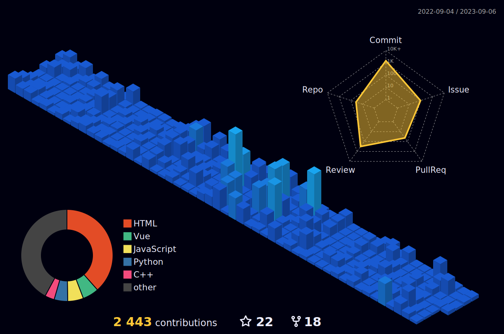

# Hi 👋, I'm Favour.

  

  <strong>I design and build autonomous agent systems, cryptographic payment rails, and private-first software suites. Driven by systems-level engineering and applied mathematics.</strong>

---

## 🏗️ Featured Proof of Work

### 🪐 Agentic Operating Systems & Orchestration
*   **[tony](https://github.com/nathfavour/tony)** – The ultimate operating system designed natively for autonomous AI agents.
*   **[polygeist](https://github.com/nathfavour/polygeist)** – A local/enterprise software engineering agentic orchestra designed to chew through codebases like paper.
*   **[anyisland](https://github.com/nathfavour/anyisland)** – The first agentic, OS-agnostic package manager that orchestrates the decentralized distribution and lifecycle of agentic software.
*   **[auracrab](https://github.com/nathfavour/auracrab)** – A ubiquitous framework for the agentic era, enabling autonomous "digital butlers" with deep system-level access and reasoning.

### 🌌 Kylrix Productivity Suite (Unified)
*A secure, private, agent-integrated ecosystem designed to reclaim digital sovereignty and cognitive flow.*
*   **[kylrix](https://github.com/nathfavour/kylrix)** – The flagship landing page and central coordinator of the Kylrix suite. Consolidates previously fragmented projects (**note**, **flow**, **vault**, and **connect**) into a single, cohesive productivity experience.

### ⚡ Systems Languages, R&D & Developer Tools
*   **[ship](https://github.com/nathfavour/ship)** – The first programming language designed from the ground up to be written, compiled, and maintained by AI agents.
*   **[duckc](https://github.com/nathfavour/duckc)** – A fast, Rust-inspired modern systems programming language designed for decentralized and blockchain networks.
*   **[Zen-C](https://github.com/nathfavour/Zen-C)** – Write like a high-level language, run like C; designed for extreme execution efficiency.
*   **[atropos](https://github.com/nathfavour/atropos)** – A Language Model Reinforcement Learning Environments framework for collecting and evaluating LLM trajectories through diverse environments.
*   **[vibeauracle](https://github.com/nathfavour/vibeauracle)** – A distributed engineering oracle bridging AI reasoning with local system telemetry.
*   **[autocommiter](https://github.com/nathfavour/autocommiter)** – AI-powered semantic git commit generator, with a high-performance port in Go at **[autocommiter.go](https://github.com/nathfavour/autocommiter.go)**.
*   **[vish](https://github.com/nathfavour/vish)** – A custom shell environment optimized for "vibe coding," streamlining the interface between the terminal and AI-assisted development.
*   **[vibetype](https://github.com/nathfavour/vibetype)** – A Go-native performance benchmarking suite for measuring interaction speed and accuracy for both humans and AI agents.

### 🛡️ Privacy, Security & Blockchain Infrastructure
*   **[shadowprism](https://github.com/nathfavour/shadowprism)** – A polyglot privacy sidecar and AI agent that aggregates Solana’s top privacy protocols into a unified, agentic interface.
*   **[settlerengine](https://github.com/nathfavour/settlerengine)** – A high-throughput cryptographic payment engine designed for autonomous settlement and transaction efficiency between agentic entities.
*   **[settledaddy](https://github.com/nathfavour/settledaddy)** – A developer-first, secure merchant payment gateway ("Stripe, but for crypto").
*   **[zDNS](https://github.com/nathfavour/zDNS)** – Networking R&D implementing private, DNS-based device discovery for zero-trust environments.
*   **[privibase](https://github.com/nathfavour/privibase)** – A self-hostable, Web3-native backend-as-a-service providing a decentralized and private alternative to legacy cloud infrastructures.
*   **[gobackhome](https://github.com/nathfavour/gobackhome)** – A self-hostable, modern backend-as-a-service (BaaS) and dashboard (**[Gobackhomeui](https://github.com/nathfavour/Gobackhomeui)**) designed to be the only backend you need.
*   **[GitGold](https://github.com/nathfavour/GitGold)** – A crypto-currency designed to reward those who maintain nodes of a decentralized Git repository.

### 🕶️ Hardware OS & Specialized Applications
*   **[clarigggzOS](https://github.com/nathfavour/clarigggzOS)** – The first AI agent-integrated smart glasses OS, designed for Risc-V architectures.
*   **[nearbychat](https://github.com/nathfavour/nearbychat)** – A Web app for sending short messages (SMS) to people nearby, where conversations disappear within 24 hours.
*   **[EasyTrace5000](https://github.com/nathfavour/EasyTrace5000)** – A 100% web-based, client-side, open-source CAM tool for PCB fabrication.
*   **[outray](https://github.com/nathfavour/outray)** – A secure, open-source alternative to ngrok for exposing local servers.

---

## 📈 GitHub Insights

  

  
  

  
  

  

  

  

